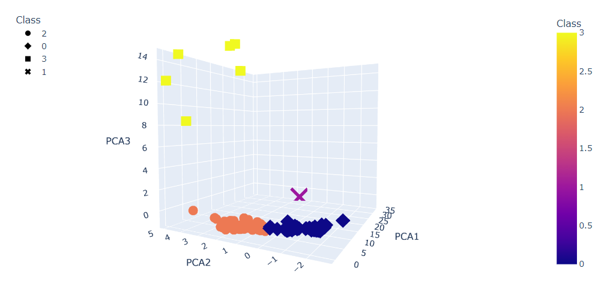
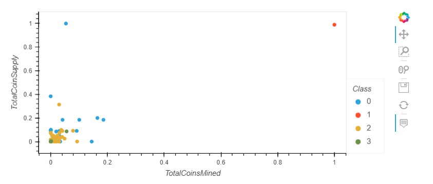

# Cryptocurrencies/Unsupervised Machine Learning (Module Challenge 18)

[Link to Deliverable 1-4 code](crypto_clustering.ipynb)

[Link to Coin Data] (https://min-api.cryptocompare.com/data/all/coinlist)

## Cryptocurrency Analysis

### Overview

Accountability Accounting, a prominent investment bank, is interested in offering a new cryptocurrency investment portfolio for its customers. 

The company, however, is lost in the vast universe of cryptocurrencies. 

So, they’ve asked for a report that includes what cryptocurrencies are on the trading market and how they could be grouped to create a classification system for this new investment.

The data to assess is not ideal, so it will need to be processed to fit the machine learning models. 

Since there is no known output for what Martha is looking for, unsupervised learning modeling will be used.

To group the cryptocurrencies, a clustering algorithm will be used to create data visualizations.

The following deliverables are provided:

* Deliverable 1: Preprocessing the Data for PCA

* Deliverable 2: Reducing Data Dimensions Using PCA

* Deliverable 3: Clustering Cryptocurrencies Using K-means

* Deliverable 4: Visualizing Cryptocurrencies Results

